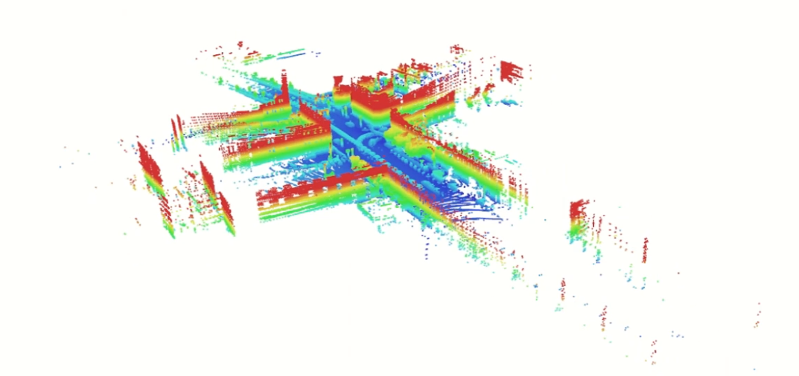
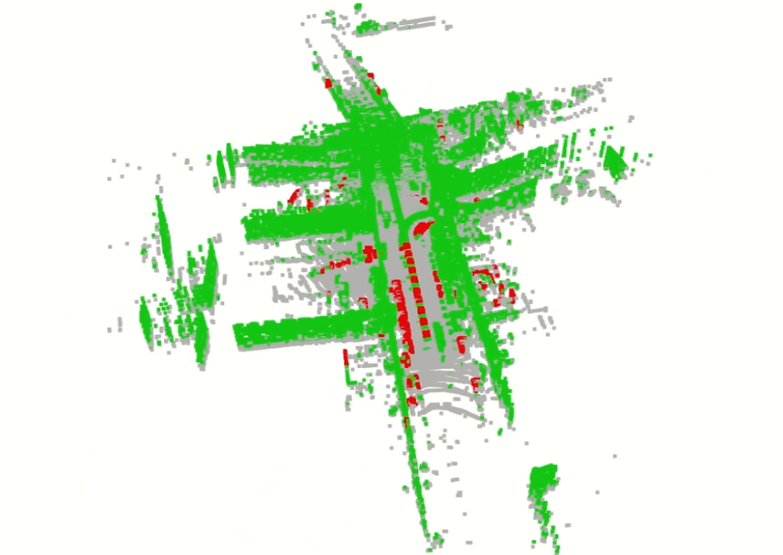
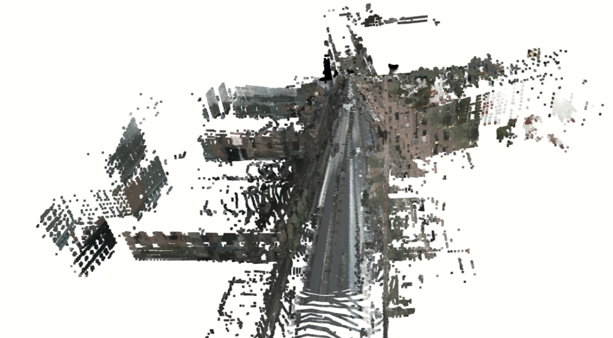

# Point Cloud Aggregation Based on GNSS-INS Data and Moving Object Filtering

## Name: Nwafor Solomon Chibuzo

## Project Overview

This project processes multi-sensor data from a vehicle equipped with a top-mounted lidar, GNSS-INS system, and multiple cameras. The goal is to create a comprehensive static point cloud representation of the environment by aggregating lidar frames, filtering non-static objects, and colorizing the result using camera imagery.

All sensors are intrinsically and extrinsically calibrated, time-synchronized, and supported by RTK correction data for GNSS accuracy. The implementation uses the nuScenes dataset and processes data without any manual annotations
## System Overview

<div align="center">
  
</div>

```
┌─────────────────────────────────────────────────────────────────┐
│                    Complete Processing Pipeline                 │
└─────────────────────────────────────────────────────────────────┘

┌──────────────┐     ┌──────────────┐     ┌──────────────┐
│   nuScenes   │     │   GNSS-INS   │     │   Cameras    │
│   Dataset    │     │     Data     │     │   (6 views)  │
└──────┬───────┘     └──────┬───────┘     └──────┬───────┘
       │                    │                    │
       │                    │                    │
       └────────────────────┼────────────────────┘
                            │
                            ▼
                    ┌───────────────┐
                    │   Task 1:     │
                    │  Aggregation  │
                    │               │
                    │ Transform all │
                    │ lidar frames  │
                    │ to global     │
                    └───────┬───────┘
                            │
                            ▼
                    ┌───────────────┐
                    │   Task 2:     │
                    │   Filtering   │
                    │               │
                    │ Remove moving │
                    │ objects using │
                    │ geometry      │
                    └───────┬───────┘
                            │
                            ▼
                    ┌───────────────┐
                    │   Task 3:     │
                    │ Colorization  │
                    │               │
                    │ Project points│
                    │ to images and │
                    │ assign colors │
                    └───────┬───────┘
                            │
                            ▼
                    ┌───────────────┐
                    │   Final       │
                    │   Output      │
                    │               │
                    │ Colored static│
                    │ point cloud   │
                    └───────────────┘
```

## Project Structure

```
GNSS_UITK8W_Nwafor_Solomon_Chibuzo/
├── README.md                  # Project documentation
├── Solomon_all_tasks_GNSS_demo.mp4  # Demo video
├── scripts/
│   ├── task1.py               # Task 1: Point cloud aggregation
│   ├── task2.py               # Task 2: Moving object filtering
│   └── task3.py               # Task 3: Point cloud colorization
├── outputs/                   # Generated point cloud files and visualizations
│   ├── taask1_scene-0103.pcd
│   ├── task1_point_cloud_aggre.png
│   ├── task2_scene-0103_ground_filtered.pcd
│   ├── task2_scene-0103_vehicle_band.pcd
│   ├── task2_scene-0103_vehicle.pcd
│   ├── task2_point_cloud_filter.png
│   ├── task3_scene-0103_colored_static.pcd
│   └── task3_point_cloud_color.png
└── nuscenes/                  # nuScenes dataset directory
```

## Task 1: Point Cloud Aggregation

### Objective

Aggregate frame-by-frame lidar point data into a single global coordinate frame using GNSS-INS ego-motion data and sensor calibration parameters.

### Approach

Each lidar frame is transformed from the sensor coordinate system to the global coordinate system through two sequential transformations:
1. Sensor to ego vehicle frame (using calibrated sensor extrinsics)
2. Ego vehicle to global frame (using GNSS-INS pose data)

### Coordinate Transformation Pipeline

```
┌─────────────────────────────────────────────────────────────┐
│                    Task 1: Aggregation Flow                 │
└─────────────────────────────────────────────────────────────┘

For each frame:
┌─────────────────────────────────────────────────────────────┐
│                      Lidar Frame                            │
│                   (Sensor coordinate system)                │
│                        Points                               │
└───────────────────────────┬─────────────────────────────────┘
                            │
                            │ Load: calibrated_sensor (extrinsics)
                            │       ego_pose (GNSS-INS position/orientation)
                            │
                            ▼
┌─────────────────────────────────────────────────────────────┐
│              Build T_sensor_to_ego                          │
│              (4x4 transformation)                           │
│              R(q_sensor), t_sensor                          │
└───────────────────────────┬─────────────────────────────────┘
                            │
                            ▼
┌─────────────────────────────────────────────────────────────┐
│              Build T_ego_to_global                          │
│              (4x4 transformation)                           │
│              R(q_ego), t_ego (GNSS-INS)                     │
└───────────────────────────┬─────────────────────────────────┘
                            │
                            ▼
┌─────────────────────────────────────────────────────────────┐
│              Apply Transformation to all points             │
│              P_global = T_ego_to_global @                   │
│                           T_sensor_to_ego @ P_sensor        │
└───────────────────────────┬─────────────────────────────────┘
                            │
                            ▼
┌─────────────────────────────────────────────────────────────┐
│              Accumulate in Global Point Cloud               │
│              Concatenate all transformed points             │
└───────────────────────────┬─────────────────────────────────┘
                            │
                            ▼
┌─────────────────────────────────────────────────────────────┐
│                      Save PCD File                          │
│              outputs/taask1_scene-XXX.pcd                   │
└─────────────────────────────────────────────────────────────┘
```

### Formulation

For each lidar frame at time t:

1. **Sensor to Ego Transformation**

The transformation matrix from sensor to ego frame is constructed from:
- Translation: `t_sensor_ego` (from calibrated_sensor)
- Rotation: `q_sensor_ego` (quaternion from calibrated_sensor)

```
T_sensor_to_ego = [R(q_sensor_ego)  t_sensor_ego]
                   [0                1            ]
```

2. **Ego to Global Transformation**

The transformation matrix from ego to global frame uses:
- Translation: `t_ego_global` (from ego_pose, GNSS-INS position)
- Rotation: `q_ego_global` (quaternion from ego_pose, GNSS-INS orientation)

```
T_ego_to_global = [R(q_ego_global)  t_ego_global]
                   [0               1           ]
```

3. **Combined Transformation**

Points in sensor frame `P_sensor` are transformed to global frame `P_global`:

```
P_global = T_ego_to_global @ T_sensor_to_ego @ P_sensor
```

Where `@` denotes matrix multiplication and `P_sensor` is in homogeneous coordinates `[x, y, z, 1]^T`.

### Implementation Details

The script processes frames sequentially:

1. Load lidar point cloud from file
2. Extract calibration data (sensor extrinsics)
3. Extract ego pose data (GNSS-INS position and orientation)
4. Construct transformation matrices using quaternion rotations
5. Apply combined transformation to all points
6. Accumulate transformed points into global cloud
7. Save aggregated point cloud as PCD file

### Why This Approach

- **Direct use of nuScenes devkit**: The nuScenes dataset provides pre-calibrated transformation matrices through `transform_matrix()` function, ensuring accuracy and consistency
- **Quaternion representation**: Quaternions avoid gimbal lock issues and provide stable rotation representation
- **Frame-by-frame processing**: Processing one frame at a time minimizes memory usage while maintaining accuracy
- **Global frame aggregation**: All points in a common coordinate system enable spatial analysis and visualization

### Usage

```bash
python scripts/aggregate_task1.py --scene scene-0103 --max-frames 40
```

### Output

- `outputs/taask1_scene-0103.pcd`: Aggregated point cloud in global frame with height-based coloring



---

## Task 2: Moving Object Filtering

### Objective

Identify and remove data corresponding to non-static objects from the aggregated point cloud in order to create a static representation of the environment.

### Approach

The filtering pipeline uses geometric analysis on the aggregated point cloud:

1. **Ground Removal**: Estimate local ground height using a percentile-based method

2. **Height Band Filtering**: Identify points in a vehicle height range (0.25 m to 3.2 m above ground)

3. **2D Clustering**: Cluster height-band points using DBSCAN in the XY plane

4. **Geometric Filtering**: Reject wall-like structures and retain compact clusters consistent with vehicle geometry

Clusters identified as vehicle-like are removed from the aggregated point cloud, producing a static environment representation.

### Processing Pipeline

```
┌─────────────────────────────────────────────────────────────┐
│              Task 2: Moving Object Filtering Flow           │
└─────────────────────────────────────────────────────────────┘

┌─────────────────────────────────────────────────────────────┐
│                   Aggregated Point Cloud                    │
│                      (from Task 1)                          │
│                      P = [x, y, z]                          │
└───────────────────────────┬─────────────────────────────────┘
                            │
                            ▼
┌─────────────────────────────────────────────────────────────┐
│            Step 1: Local Ground Height Estimation           │
│                                                             │
│  1. Divide XY into cells (0.4m x 0.4m)                      │
│  2. For each cell:                                          │
│     z_ground = percentile(z_points, 12%)                    │
│  3. Compute height above ground:                            │
│     h = z - z_ground                                        │
└───────────────────────────┬─────────────────────────────────┘
                            │
                            ▼
┌─────────────────────────────────────────────────────────────┐
│                Step 2: Height Band Filtering                │
│                                                             │
│  above_ground = h > 0.25m                                   │
│  vehicle_band = (0.25m < h < 3.2m)                          │
└───────────────────────────┬─────────────────────────────────┘
                            │
                            ▼
┌─────────────────────────────────────────────────────────────┐
│                 Step 3: 2D DBSCAN Clustering                │
│                                                             │
│  1. Project to XY: pts_2d = [x, y, 0]                       │
│  2. Cluster with DBSCAN:                                    │
│     - eps = 0.65m                                           │
│     - min_points = 8                                        │
│  3. Get cluster labels                                      │
└───────────────────────────┬─────────────────────────────────┘
                            │
                            ▼
┌─────────────────────────────────────────────────────────────┐
│              Step 4: Geometric Shape Analysis               │
│                                                             │
│  For each cluster:                                          │
│    1. Compute bounding box:                                 │
│       dims = [dx, dy, dz]                                   │
│       length = max(dx, dy)                                  │
│       width = min(dx, dy)                                   │
│                                                             │
│    2. Apply filters:                                        │
│       ✓ Height: 0.25m <= dz <= 3.2m                         │
│       ✓ Length: <= 15.0m                                    │
│       ✓ Width: <= 5.0m                                      │
│       ✓ Points: >= 25                                       │
│                                                             │
│    3. Reject walls:                                         │
│       ✗ Long & thin: length >= 6.0m                         │
│         AND width <= 0.35m                                  │
│       ✗ Ratio: length/width >= 18.0                         │
│       ✗ Long low: length > 12.0m                            │
│         AND dz < 1.5m                                       │
└───────────────────────────┬─────────────────────────────────┘
                            │
                            ▼
┌─────────────────────────────────────────────────────────────┐
│                       Filtered Mask                         │
│                                                             │
│  moving_mask: True for vehicle clusters                     │
│  static_mask: ~moving_mask                                  │
└─────────────────────────────────────────────────────────────┘
```

### Formulation

#### Step 1: Local Ground Height Estimation

The ground height is estimated per spatial cell using percentile method:

1. Divide XY plane into cells of size `cell_size` (0.4m):
```
cell_x = floor(x / cell_size)
cell_y = floor(y / cell_size)
```

2. For each cell, compute ground height as percentile of Z values:
```
z_ground[cell] = percentile(z_points_in_cell, percentile_value)
```

I chose percentile of 12.0, which selects points near the ground surface while rejecting outliers.

3. Height above ground for each point:
```
h = z_point - z_ground[cell]
```

#### Step 2: Height Band Filtering

Points are classified into height bands:

```
above_ground = h > h_min  (0.25m)
vehicle_band = (h > h_min) & (h < h_max)  (0.25m - 3.2m)
```

The vehicle band captures objects in the typical height range of vehicles while excluding ground and tall structures.

#### Step 3: 2D DBSCAN Clustering

Points in the vehicle band are clustered in 2D (ignoring Z coordinate):

1. Project points to XY plane: `pts_2d = [x, y, 0]`
2. Apply DBSCAN clustering:
   - `eps`: Maximum distance between points in same cluster (0.65m)
   - `min_points`: Minimum points required to form cluster (8)

DBSCAN groups spatially connected points into clusters, separating individual objects.

#### Step 4: Geometric Shape Analysis

Each cluster is analyzed for geometric properties:

1. **Bounding Box Dimensions**:
```
dims = [max_x - min_x, max_y - min_y, max_z - min_z]
length_xy = max(dims[0], dims[1])
width_xy = min(dims[0], dims[1])
height = dims[2]
```

2. **Vehicle Filtering Criteria**:

A cluster is kept if it satisfies:
- Height constraint: `h_min <= height <= min(h_max, veh_max_h)`
- Length constraint: `length_xy <= veh_max_len` (15.0m)
- Width constraint: `width_xy <= veh_max_w` (5.0m)
- Minimum points: `cluster_size >= veh_min_points` (25)

3. **Wall Rejection Criteria**:

A cluster is rejected if it matches wall characteristics:
- Long and thin: `length_xy >= wall_min_len` (6.0m) AND `width_xy <= wall_max_thickness` (0.35m)
- Aspect ratio: `length_xy / width_xy >= wall_min_len_over_thickness` (18.0)
- Long low structures: `length_xy > 12.0m` AND `height < 1.5m`

### Why This Approach

- **Annotation-free**: Uses only geometry and ego-motion, fully compliant with assignment constraints
- **Motion proxy via aggregation artifacts**: Moving vehicles introduce spatial inconsistency when aggregated into a global frame, unlike static structures
- **Percentile-based ground estimation**: Robust to outliers and uneven terrain
- **Height band filtering**: Focuses computation on likely non-static objects
- **2D clustering**: Vehicles form spatially compact regions in top-down view
- **Geometric heuristics**: Vehicle dimensions are well constrained and interpretable
- **Wall rejection**: Long, thin, or planar structures are explicitly filtered out

### Limitations

- Parked vehicles may be removed even if static
- Small moving objects such as pedestrians or cyclists may not be detected

### Implementation Details

The script uses voxel downsampling per frame (0.20m) before aggregation to reduce point density while preserving structure. This balances detail with computational efficiency.

### Usage

```bash
python scripts/task2.py --scene scene-0103 --max-frames 40
```

### Outputs

- `outputs/task2_scene-0103_ground_filtered.pcd`: Points above ground level
- `outputs/task2_scene-0103_vehicle_band.pcd`: Points in vehicle height band
- `outputs/task2_scene-0103_vehicle.pcd`: Identified moving objects (vehicles)



---

## Task 3: Point Cloud Colorization

### Objective

Enhance the static virtual point cloud by assigning color values to points using image data from the cameras.

### Approach

The colorization process:

1. Apply Task 2 filtering to identify static points
2. For each camera, project 3D points to image plane
3. Sample colors from images at projected pixel locations
4. Select best color for each point based on camera distance (closest valid camera wins)

### Processing Pipeline

```
┌─────────────────────────────────────────────────────────────┐
│            Task 3: Point Cloud Colorization Flow            │
└─────────────────────────────────────────────────────────────┘

┌─────────────────────────────────────────────────────────────┐
│                     Static Point Cloud                      │
│        (from Task 2, moving objects removed)                │
│                   P_world = [x, y, z]                       │
└───────────────────────────┬─────────────────────────────────┘
                            │
                            ▼
┌─────────────────────────────────────────────────────────────┐
│                  Initialize Color Arrays                    │
│                                                             │
│  colors = zeros(N, 3)                                       │
│  best_dist = inf(N)                                         │
└───────────────────────────┬─────────────────────────────────┘
                            │
                            │ For each camera (6 cameras):
                            │   CAM_FRONT, CAM_FRONT_LEFT, CAM_FRONT_RIGHT,
                            │   CAM_BACK, CAM_BACK_LEFT, CAM_BACK_RIGHT
                            │
                            ▼
┌─────────────────────────────────────────────────────────────┐
│            Step 1: Build Camera Transformation              │
│                                                             │
│  1. Get camera calibration:                                 │
│     T_cam_to_vehicle, K (intrinsics)                        │
│                                                             │
│  2. Get ego pose:                                           │
│     T_vehicle_to_world                                      │
│                                                             │
│  3. Compute:                                                │
│     T_world_to_cam =                                        │
│       (T_vehicle_to_world @                                 │
│        T_cam_to_vehicle)^(-1)                               │
└───────────────────────────┬─────────────────────────────────┘
                            │
                            ▼
┌─────────────────────────────────────────────────────────────┐
│             Step 2: Project 3D Points to Image              │
│                                                             │
│  For each point P_world:                                    │
│    1. Transform to camera frame:                            │
│       P_cam = T_world_to_cam @ P_world                      │
│                                                             │
│    2. Project to image:                                     │
│       [u', v', w'] = K @ P_cam                              │
│       u = u' / w'                                           │
│       v = v' / w'                                           │
│                                                             │
│    3. Check validity:                                       │
│       valid = (w' > 0) AND                                  │
│               (0 <= u < width) AND                          │
│               (0 <= v < height)                             │
└───────────────────────────┬─────────────────────────────────┘
                            │
                            ▼
┌─────────────────────────────────────────────────────────────┐
│              Step 3: Sample Colors from Image               │
│                                                             │
│  For valid points:                                          │
│    color = image[round(v), round(u), :]                     │
│    if max(color) > 1.0:                                     │
│        color = color / 255.0                                │
└───────────────────────────┬─────────────────────────────────┘
                            │
                            ▼
┌─────────────────────────────────────────────────────────────┐
│                 Step 4: Select Best Color                   │
│                                                             │
│  For each point:                                            │
│    distance = ||P_world - cam_position||                    │
│                                                             │
│    if (valid AND distance < best_dist):                     │
│        colors[point] = sampled_color                        │
│        best_dist[point] = distance                          │
└───────────────────────────┬─────────────────────────────────┘
                            │
                            │ (Repeat for all 6 cameras)
                            │
                            ▼
┌─────────────────────────────────────────────────────────────┐
│                Colored Static Point Cloud                   │
│                                                             │
│  Points with RGB colors from nearest visible camera         │
└─────────────────────────────────────────────────────────────┘
```

### Formulation

#### Step 1: Camera Transformation Matrix

For each camera, construct transformation from world to camera frame:

1. **Camera to Vehicle Frame**:
```
T_cam_to_vehicle = [R(q_cam_calib)  t_cam_calib]
                    [0               1           ]
```

2. **Vehicle to World Frame**:
```
T_vehicle_to_world = [R(q_ego_pose)  t_ego_pose]
                      [0              1         ]
```

3. **World to Camera Frame**:
```
T_world_to_cam = (T_vehicle_to_world @ T_cam_to_vehicle)^(-1)
```

4. **Camera Intrinsic Matrix K**:
```
K = [fx  0   cx]
    [0   fy  cy]
    [0   0   1 ]
```

Where `fx, fy` are focal lengths and `cx, cy` is principal point.

#### Step 2: Point Projection

For each 3D point `P_world = [x, y, z]^T`:

1. **Transform to Camera Frame**:
```
P_cam = T_world_to_cam @ [x, y, z, 1]^T
```

2. **Project to Image Plane**:
```
[u', v', w']^T = K @ P_cam
u = u' / w'
v = v' / w'
```

Where `(u, v)` are pixel coordinates and `w'` is depth.

3. **Validity Check**:
Point is visible if:
- `depth > 0` (point in front of camera)
- `0 <= u < image_width`
- `0 <= v < image_height`

#### Step 3: Color Sampling

For valid projections:
```
color = image[round(v), round(u), :]
```

If image values are in [0, 255], normalize to [0, 1]:
```
color_normalized = color / 255.0
```

#### Step 4: Best Color Selection

For each point, maintain:
- `best_color`: Current best RGB color
- `best_distance`: Distance to current best camera

When processing each camera:
```
distance = ||P_world - camera_position||
if (point_valid && distance < best_distance && color_valid):
    best_color = sampled_color
    best_distance = distance
```

This ensures each point gets color from the nearest camera that can see it.

### Why This Approach

- **Multi-camera fusion**: Using all 6 cameras (front, front-left, front-right, back, back-left, back-right) provides 360-degree coverage
- **Distance-based selection**: Nearest camera provides highest resolution and least occlusion
- **Projective geometry**: Standard pinhole camera model is accurate for calibrated cameras
- **Per-point color assignment**: Each point independently gets best available color
- **Static points only**: Filtering moving objects ensures colors represent static environment

### Implementation Details

The script processes all cameras from the first sample frame. This provides a consistent baseline for colorization across the entire aggregated cloud. Points that are not visible in any camera remain black (RGB = [0, 0, 0]).

### Usage

```bash
python scripts/task3.py --scene scene-0103 --max-frames 40
```

### Outputs

- `outputs/task3_scene-0103_colored_static.pcd`: Static point cloud with colors from cameras



---

## Coordinate Systems

### Frame Definitions

1. **Sensor Frame**: Origin at lidar sensor, axes aligned with sensor orientation
2. **Ego Vehicle Frame**: Origin at vehicle center, typically X-forward, Y-left, Z-up
3. **Global Frame**: Earth-fixed coordinate system (e.g., UTM or local ENU), provided by GNSS-INS
4. **Camera Frame**: Origin at camera optical center, Z-forward (optical axis), X-right, Y-down

### Transformation Chain

```
Sensor Frame → Ego Frame → Global Frame
                    ↓
              Camera Frame (for colorization)
```

All transformations use 4x4 homogeneous transformation matrices for efficient composition.

---

## Dependencies

- Python 3.x
- numpy: Numerical computations
- open3d: Point cloud processing and visualization
- nuscenes-devkit: nuScenes dataset access and utilities
- pyquaternion: Quaternion operations
- matplotlib: Image loading

---

## Running the Complete Pipeline

Execute tasks sequentially:

```bash
# Task 1: Aggregate point clouds
python scripts/task1.py --scene scene-0103 --max-frames 40

# Task 2: Filter moving objects
python scripts/task2.py --scene scene-0103 --max-frames 40

# Task 3: Colorize static cloud
python scripts/task3.py --scene scene-0103 --max-frames 40
```

Each task produces intermediate outputs that can be visualized and analyzed independently.

---

## Key Design Decisions

### Why Percentile-Based Ground Estimation?

Mean-based methods are sensitive to outliers (vehicles, poles). Median is more robust but still affected by dense objects. The 12th percentile selects points near the ground surface while rejecting most above-ground objects, providing a robust ground model.

### Why 2D Clustering?

Vehicles appear as connected regions when viewed from above. Clustering in XY plane captures this structure while being computationally efficient. Height information is used separately for filtering.

### Why Geometric Heuristics?

Motion labels are not available in the point cloud data, and manual annotation is explicitly disallowed.
Geometric heuristics provide an interpretable, annotation-free way to remove the dominant non-static elements affecting map quality.

### Why Distance-Based Color Selection?

The nearest camera to a point provides:
- Highest resolution (points appear larger in image)
- Least occlusion (fewer objects between camera and point)
- Best lighting conditions (typically)

This simple heuristic produces visually coherent results.

---

## Limitations and Future Work

### Current Limitations

1. **Proxy-based motion definition**: Moving objects are inferred via geometry, not tracked motion
2. **Parameter sensitivity**: Thresholds are tuned for urban driving scenes
3. **Occlusion handling**: Points occluded in all cameras remain uncolored
4. **Single-frame colorization**: Camera images from the first frame are used

### Potential Improvements

1. **Temporal consistency**: Use multiple frames to improve colorization coverage
2. **Adaptive thresholds**: Adjust filtering parameters based on scene characteristics
3. **Occlusion reasoning**: Infer colors for occluded points from nearby visible points
4. **Multi-frame color fusion**: Average colors from multiple camera frames for stability

---

## References

- nuScenes Dataset: https://www.nuscenes.org/
- Open3D: http://www.open3d.org/
- DBSCAN Clustering: Ester et al., "A density-based algorithm for discovering clusters in large spatial databases", KDD 1996
